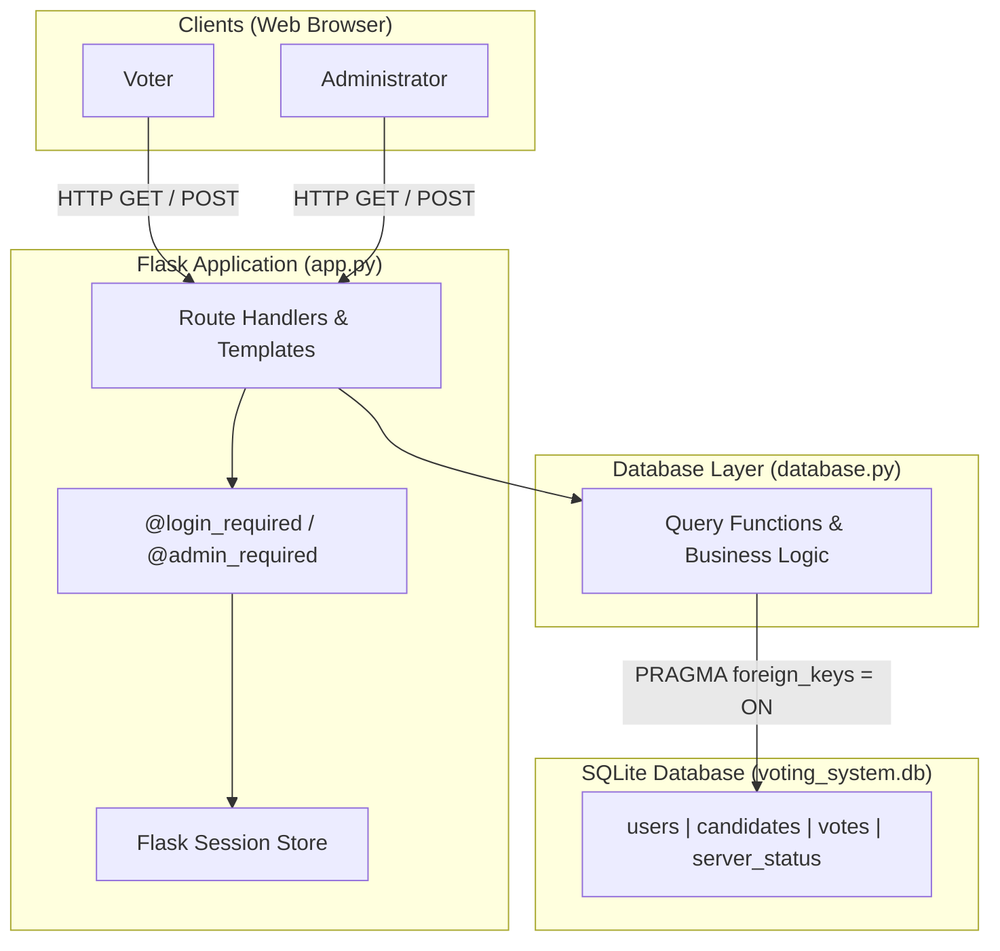

# Online Voting System

A clean, full-stack Flask web application for managing academic and organizational elections. The system provides role-based authentication, candidate and voter management, election lifecycle controls, single-ballot enforcement, and real-time vote tallying.


---

## Overview

The Online Voting System is designed to conduct structured digital elections for student organizations, clubs, and academic cohorts. It replaces manual paper ballots and ad-hoc surveys with a secure, auditable, and self-contained web platform.

### Core Workflows

- **Voter Workflow:** Eligible voters register an account, log into their personal voter dashboard, view the current election status and active candidate list, cast exactly one verified ballot, and receive an instant submission confirmation.
- **Administrator Workflow:** Election administrators log in through a privileged account to toggle poll status (Open/Closed), manage candidates (add, activate/deactivate, or delete zero-vote candidates), manage voter accounts (safely removing unvoted accounts while preserving cast ballots), and monitor real-time vote tallies.
- **Election Lifecycle:** Polls operate under an explicit state machine (`Closed` $\leftrightarrow$ `Open`). Ballot submission is strictly prohibited while voting is closed, and candidate deletion is locked while voting is actively underway.

---

## Key Features

### Voter Features
- **Account Registration & Login:** Self-service registration with email uniqueness validation and password hashing.
- **Personal Voter Dashboard:** Displays voter identity, current election state (Open / Closed / Not Started), active candidate count, and personalized ballot status (`Not Yet Voted` vs. `Ballot Submitted`).
- **Interactive Ballot Casting:** Form featuring candidate detail cards, single-choice radio selection, and a JavaScript confirmation prompt before submission.
- **Single-Ballot Enforcement:** Strict one-voter-one-vote rule enforced at the route level, service level, and database schema level.
- **Already-Voted Protection:** Voters who have already cast a ballot are blocked from accessing the voting form and redirected to an explanatory `already_voted.html` notice.
- **Post-Vote Confirmation:** Clear confirmation screen (`thankyou.html`) acknowledging receipt of the vote.

### Administrator Features
- **Role-Based Admin Portal:** Dedicated administrative dashboard protected by `@admin_required` authorization decorators.
- **Election Session Controls:** Instant one-click toggle to open or close the voting session.
- **Candidate Administration:**
  - Add candidates with name, party/description, and active status.
  - Deactivate candidates to hide them from the voter ballot without deleting historical records.
  - Delete zero-vote candidates permanently when the election is closed.
  - Safe deletion blocker preventing removal of any candidate who has already received recorded votes.
  - Safe deletion blocker preventing candidate deletion while polls are open.
- **Voter Account Management:**
  - Table of registered voters displaying participation status (`Ballot Submitted` vs. `Not Yet Voted`).
  - Delete unvoted voter accounts (e.g., typos, invalid entries).
  - Hard constraint blocking the deletion of any voter who has already cast a ballot.
  - Permanent protection blocking deletion of the primary administrator account.
- **Vote Tallying & Results:** Real-time vote counts and total vote calculations with deduplication and zero-vote candidate display on `/results`.
- **Database Maintenance:** Administrative "Clear All Votes" action with browser confirmation prompt.

---

## Security

The application implements defensive security controls focused on data integrity and authorization boundaries:

- **Password Hashing:** Passwords are never stored in plaintext. Passwords are encrypted using Werkzeug's secure `generate_password_hash` (scrypt / PBKDF2).
- **Session-Based Authentication:** Signed HTTP session cookies manage authenticated state with server-side role verification on every privileged request.
- **Role-Based Access Control (RBAC):** All administrative routes (`/admin_dashboard`, `/results`, `/toggle_voting`, `/clear_votes`, `/admin/candidates/*`, `/admin/users/*`) enforce strict `@admin_required` guards. Unauthorized access yields a dedicated `access_denied.html` boundary.
- **Admin Voting Restriction:** Administrators are explicitly barred from voting to maintain election neutrality.
- **Parameterized SQL Queries:** 100% of SQLite database queries use parameterized `?` placeholders, eliminating SQL injection vectors.
- **Database-Level Single-Vote Constraint:** A unique index `idx_votes_user_id` on `votes (user_id)` guarantees at the database engine level that no user can record multiple ballots.
- **Historical Ballot Immutability:** Foreign key constraints (`votes.user_id REFERENCES users(id)`) combined with application-level validation prevent deleting users or candidates tied to historical ballots.
- **POST-Only State Modifications:** All administrative and voting state changes require HTTP `POST` requests; destructive actions cannot be triggered via `GET` links.
- **Explicit Confirmation Prompts:** Destructive administrative actions (clearing votes, deleting candidates, deleting accounts) require JavaScript confirmation prompts.

### Production Hardening

This project was developed as an academic and resume portfolio project. Before deploying to an untrusted public production environment, the following hardening steps are required:
- **CSRF Token Protection:** Implement anti-CSRF tokens (e.g., Flask-WTF) across all POST forms (the application currently relies on browser-default `SameSite=Lax` cookie policy).
- **Production Secret Key:** Configure a cryptographically random `SECRET_KEY` environment variable instead of using the local development fallback.
- **Production WSGI Server:** Deploy behind a production WSGI container such as Gunicorn or uWSGI behind an Nginx reverse proxy rather than the Flask built-in development server.
- **HTTPS / TLS:** Serve exclusively over HTTPS with secure cookie flags (`SESSION_COOKIE_SECURE = True`, `SESSION_COOKIE_HTTPONLY = True`).
- **Account Recovery & Rate Limiting:** Implement rate limiting (e.g., Flask-Limiter) on authentication endpoints and email-based password reset workflows.

---

## Architecture

The project follows a modular Model-View-Controller (MVC) style pattern:



---

## Database Schema

The SQLite schema is managed by `database.py` with foreign key enforcement enabled (`PRAGMA foreign_keys = ON`).

```
 +-----------------------------------+          +-----------------------------------+
 |               users               |          |               votes               |
 +-----------------------------------+          +-----------------------------------+
 | id        INTEGER PRIMARY KEY     |<----+    | id        INTEGER PRIMARY KEY     |
 | name      TEXT                    |     +----| user_id   INTEGER (FK -> users.id)|
 | email     TEXT NOT NULL UNIQUE    |          | candidate TEXT NOT NULL           |
 | password  TEXT NOT NULL           |          +-----------------------------------+
 +-----------------------------------+               * UNIQUE INDEX on user_id *

 +-----------------------------------+          +-----------------------------------+
 |            candidates             |          |           server_status           |
 +-----------------------------------+          +-----------------------------------+
 | id          INTEGER PRIMARY KEY   |          | id        INTEGER PRIMARY KEY     |
 | name        TEXT NOT NULL UNIQUE  |          | is_open   INTEGER DEFAULT 0       |
 | description TEXT                  |          +-----------------------------------+
 | is_active   INTEGER DEFAULT 1     |
 +-----------------------------------+
```

### Table Details

1. **`users`**:
   - `id`: Auto-incrementing primary key.
   - `name`: Full name of the user.
   - `email`: Unique email address used for authentication.
   - `password`: Hashed password string (generated via Werkzeug).
2. **`candidates`**:
   - `id`: Auto-incrementing primary key.
   - `name`: Unique candidate name.
   - `description`: Platform description, party affiliation, or bio.
   - `is_active`: Flag (`1` = active and visible on ballot, `0` = deactivated).
3. **`votes`**:
   - `id`: Auto-incrementing primary key.
   - `user_id`: Foreign key referencing `users.id`.
   - `candidate`: Candidate name recorded on the ballot.
   - **Constraint:** `CREATE UNIQUE INDEX idx_votes_user_id ON votes (user_id)` guarantees that each user ID can appear at most once in the table.
4. **`server_status`**:
   - `id`: Primary key (single-row record, `id = 1`).
   - `is_open`: Integer flag (`1` = election Open/started, `0` = election Closed/ended).

---

## Project Structure

```
Online-Voting-System/
├── app.py                  # Flask web application, route handlers, auth decorators
├── database.py             # Database access layer, schema definitions, query logic
├── reset.py                # Database reset and initial seed utility
├── requirements.txt        # Python package dependencies
├── test_suite.py           # 36-test automated regression and integration test suite
├── voting_system.db        # Clean SQLite database (1 admin, 3 candidates, 0 votes)
├── static/
│   └── style.css           # Custom CSS rules, typography, and candidate card styles
└── templates/
    ├── access_denied.html  # Access control boundary message
    ├── admin_dashboard.html# Administrator portal (election, candidate, voter management)
    ├── already_voted.html  # Notice page when a voter attempts to vote again
    ├── base.html           # Master layout with responsive navbar and flash alerts
    ├── dashboard.html      # Voter dashboard showing election and ballot status
    ├── index.html          # Public landing page with status badge and workflow steps
    ├── login.html          # User authentication sign-in form
    ├── register.html       # Voter registration form
    ├── results.html        # Election results and vote tally table
    ├── thankyou.html       # Ballot submission success confirmation
    └── vote.html           # Ballot selection and vote submission form
```

---

## Quick Start

### Prerequisites
- Python 3.10 or higher
- `pip` (Python package manager)
- `git`

### Installation & Setup

1. **Clone the repository:**
   ```bash
   git clone <your-repository-url>
   cd <repository-folder>
   ```

2. **Create and activate a virtual environment:**
   - **Windows (Command Prompt / PowerShell):**
     ```powershell
     python -m venv venv
     venv\Scripts\activate
     ```
   - **macOS / Linux:**
     ```bash
     python3 -m venv venv
     source venv/bin/activate
     ```

3. **Install dependencies:**
   ```bash
   pip install -r requirements.txt
   ```

4. **Launch the application:**
   ```bash
   python app.py
   ```

5. **Access the application:**
   Open your browser and navigate to:
   ```
   http://127.0.0.1:5000
   ```

---

## Default Demo Credentials

For demonstration and grading evaluation, a pre-seeded administrator account is provided:

| Role | Email | Password | Access Level |
| :--- | :--- | :--- | :--- |
| **Administrator** | `admin@admin.com` | `admin123` | Full election, candidate, and voter management |

> **Security Notice:** The credentials above are intended strictly for local academic demonstration. For any non-demonstration deployment, the administrator password must be updated.

---

## Voter Usage

1. Open `http://127.0.0.1:5000` and click **Create an Account** (or navigate to `/register`).
2. Register with your name, a unique email, and a password.
3. Log in with your new credentials.
4. From the **Voter Dashboard**, when polls are **Open**, click **Cast My Vote**.
5. Select your preferred candidate and click **Submit Vote**. Confirm your selection in the popup dialog.
6. Once submitted, your dashboard transitions to `Ballot Submitted` / `Vote Recorded`.

---

## Database Reset Utility

The project includes an administrative reset utility (`reset.py`) to safely restore the database to its pristine evaluation state:

- **Interactive Reset (Default):**
  Prompts for confirmation before making destructive changes:
  ```bash
  python reset.py
  ```
  *(Requires typing `YES` to proceed.)*

- **Non-Interactive Reset:**
  Bypasses the confirmation prompt (useful for scripted environments):
  ```bash
  python reset.py --yes
  ```

- **Custom Database Target:**
  Specify a custom database path:
  ```bash
  python reset.py path/to/database.db --yes
  ```

### What the Reset Does:
1. Safely drops all application tables (`votes`, `candidates`, `users`, `server_status`).
2. Clears SQLite autoincrement sequences (`sqlite_sequence`).
3. Recreates the complete schema via canonical `database.init_db()`.
4. Seeds the default Administrator account (`admin@admin.com` / `admin123`).
5. Seeds the 3 default candidates: **Candidate A**, **Candidate B**, **Candidate C** (all active).
6. Sets election status to **CLOSED**.
7. Leaves exactly 0 votes and 0 voter accounts.

---

## Automated Testing

The project includes an automated test suite (`test_suite.py`) containing **36 unit, integration, and security tests**.

### Test Isolation
All tests run against an isolated temporary database (`test_voting_system.db`). Running tests **never modifies** the live or demo `voting_system.db`.

### Running the Tests

Ensure your virtual environment is active, then execute:

```bash
python -m unittest test_suite.py
```

### Verified Test Results
```
....................................
----------------------------------------------------------------------
Ran 36 tests in 12.399s

OK
```

### Test Coverage Highlights:
- Default candidate and administrator seeding.
- User registration validation (empty fields, malformed emails, reserved admin email, duplicate emails).
- Authentication and session handling (valid login, invalid login, logout session clearing).
- Single-vote limits and duplicate ballot blocking at route, service, and database levels.
- Election status enforcement (blocking vote submission on GET and POST when polls are closed).
- Candidate lifecycle rules (activation, deactivation, deletion blocked while open, deletion blocked with votes).
- Voter account management rules (unvoted voter deletion, blocking deletion of voted voters, blocking administrator deletion).
- Role-based authorization boundary enforcement across all admin endpoints.
- Results normalization, legacy vote deduplication, and zero-vote candidate tallying.
- Database reset utility verification and idempotency.

---

## Limitations

- **Concurrency & Scaling:** SQLite is ideal for development, demonstration, and low-concurrency environments. For high-volume institutional elections with hundreds of concurrent requests, a client-server RDBMS (e.g., PostgreSQL or MySQL) is recommended.
- **Account Recovery:** The system does not currently include email verification or password reset links.
- **CSRF Protection:** Anti-CSRF tokens are not currently integrated into form requests; the application currently relies on standard browser `SameSite=Lax` cookie behaviors.
- **Default Credentials:** Default evaluation credentials are documented publicly for evaluator convenience.

---

## Future Improvements

- Integration of Flask-WTF for per-form cryptographic CSRF token validation.
- Email integration (SMTP) for account confirmation and password recovery tokens.
- Export results to downloadable formats (CSV / PDF audit summaries).
- Detailed administrative audit logs recording timestamps for election state changes.
- Containerization with Docker and Docker Compose for automated deployment.

---

<!-- Screenshots can be added here after capturing the final UI. -->
